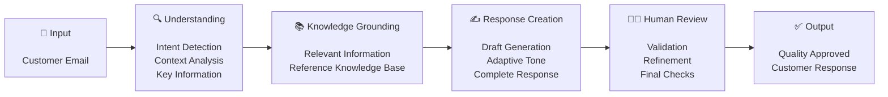
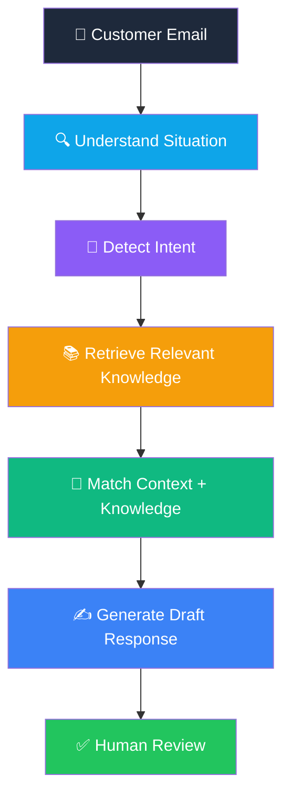

# 📧 AI Email Productivity Assistant
A self-initiated AI productivity solution designed to improve communication quality, reduce rework, and accelerate response creation through prompt engineering, knowledge-grounded generation, and human-in-the-loop review.

### From Struggling with Email Quality to Building an AI Solution That Fixed It

*I was a new joiner making mistakes in customer emails and getting frequent rejections. Instead of just accepting it, I built an AI agent that transformed my email quality — without writing a single line of code.*

[My Story](#-my-story) · [Problem](#-the-problem) · [Solution](#-what-i-built) · [Features](#-key-features) · [Impact](#-business-impact) · [Architecture](#-how-it-works) · [Learnings](#-what-i-learned)

---

> ⚠️ **Disclaimer:** This repository is a portfolio case study. It documents the concept, design approach, and impact of an AI solution I independently designed and deployed for my personal use in a professional environment. No proprietary tools, platform names, production prompts, internal systems, customer data, or confidential information is included. All content is presented at a conceptual level.

---

## 🙋 My Story

When I joined the customer operations team, I was responsible for handling customer email communications. Every email I drafted had to go through a **Quality Review process** before being sent to the customer.

### The Honest Truth: I Was Struggling (This Agent Was Built and Used Only by Me)

As a new team member, my emails had frequent issues:

- ❌ **Lack of empathy** — My responses were technically correct but felt cold and impersonal
- ❌ **Missing key information** — I would overlook general information the customer needed for their specific situation
- ❌ **Incomplete responses** — Not addressing all the customer's concerns in a single reply
- ❌ **Inconsistent tone** — My writing style varied depending on my workload and energy
- ❌ **High rejection rate** — My drafts were frequently sent back by team leaders with corrections

Every rejected email meant:
- ⏱️ Time wasted rewriting
- 😤 Frustration for me and the approver
- 🐢 Delayed responses for the customer
- 📉 Lower productivity metrics

### The Turning Point

Instead of just accepting these challenges as "part of the learning curve," I asked myself:

> *"What if I could build something that helps me get it right the first time?"*

I had access to an **enterprise generative AI platform** at work that allowed employees to build custom AI agents — no coding required. I decided to build one myself, **on my own initiative, without being asked**, purely for my personal use.

### Building It Wasn't Easy

- 🔧 The first version had glitches — the outputs weren't accurate enough
- 🔄 I iterated repeatedly, tweaking the design and refining my approach
- 📚 I experimented with different configurations to find the right balance
- ✅ After several rounds of refinement, the agent started producing quality drafts

**The result?** My email quality improved dramatically. Rejection rates dropped. Response times got faster. And I went from struggling to consistently producing quality outputs.

---

## 🔍 The Problem

### Context: Customer Service Operations

In travel insurance operations, customer-facing professionals handle a high volume of emails daily. Each email requires:

| Requirement | Challenge |
|:------------|:----------|
| 🧐 **Careful comprehension** | Understanding the customer's situation, emotions, and specific needs |
| 🎯 **Intent identification** | Is this a claim inquiry? A complaint? A policy question? A follow-up? |
| 🔑 **Situation-based information** | Identifying which general information from the Reference Documentation (Knowledge Repository) is relevant to the customer's specific situation |
| 💬 **Empathetic communication** | Responding with appropriate tone, empathy, and professionalism |
| 📚 **Product knowledge** | Knowing which general product information applies to the customer's scenario |
| ✍️ **Quality drafting** | Composing a complete, accurate, and professional response |
| ✅ **Approval readiness** | Ensuring the draft passes Reviewer on the first attempt |

### The Approval Workflow
┌──────────────┐ ┌──────────────────┐ ┌─────────────────┐ │ Customer │ │ I Draft the │ │ Team Leader │ │ Sends Email │────▶│ Response │────▶│ Reviews Draft │ └──────────────┘ └──────────────────┘ └────────┬────────┘ │ ┌────────┴────────┐ │ │ ✅ Approved ❌ Rejected │ │ ▼ ▼ Sent to Sent back to me Customer for Corrections │ ▼ I Rewrite (Cycle Repeats)

### My Pain Points as a New Joiner

- 📝 Drafting emails took me significantly longer than experienced colleagues
- 🔄 High rejection rate meant double or triple the work per email
- 😟 Missed empathy cues — I focused on facts but forgot the human element
- 📋 Didn't always know which general information from the Knowledge Repository was relevant to the customer's specific situation
- 🧠 Struggled to identify the right general information to provide based on the customer's scenario
- ⏱️ All of this impacted my productivity, metrics, and confidence

---

## 💡 What I Built

I designed and deployed a **custom AI agent** on the enterprise generative AI platform — entirely through **no-code configuration and prompt engineering**. This was built and used only by me, for my personal productivity.

### What the Agent Does — and What It Doesn't Do

> 🔑 **Important — what the agent does:**
> - Analyzes the customer's email to understand their situation
> - Picks up **relevant general information from the Knowledge Repository** (Reference Documentation) that applies to the customer's specific scenario
> - Drafts response content using that relevant general information
> - It does **NOT** access or expose internal policy details, confidential data, or anything beyond publicly available product information from the Knowledge Repository
>
> 🔑 **Important — what the agent does NOT do:**
> - Does NOT connect to any email client
> - Does NOT send emails
> - Does NOT format anything
> - Does NOT access internal/confidential policy details
>
> **My manual workflow after the AI generates a draft:**
> 1. **Copy** the AI-generated text
> 2. **Paste** it into Outlook
> 3. **Manually format** it (fonts, styling, layout, structure)
> 4. **Review and edit** the content for accuracy
> 5. **Submit** for Quality Review
>
> The AI is purely a **content drafting tool** that surfaces relevant general product information for the customer's situation. Everything else is manual and under my full control.

### Solution at a Glance

The AI agent acts as my personal email content drafting assistant that:

1. **Reads and analyzes** the incoming customer email I provide to it
2. **Identifies** the customer's intent, emotions, and specific situation
3. **Surfaces** relevant general information from the Knowledge Repository based on the customer's scenario
4. **Extracts** key details from the email (names, dates, travel details, specific requests)
5. **Generates** a professional, empathetic, and complete text draft incorporating the right general information
6. **I then copy** the draft text into Outlook, manually format it, review and edit, then submit for approval

### How I Designed It

| Design Aspect | My Approach |
|:--------------|:------------|
| **Core Capability** | Designed the agent to analyze customer emails and generate draft text content |
| **Knowledge Repository Knowledge Base** | Connected the Reference Documentation (Knowledge Repository) as a knowledge source so the agent could identify and surface relevant general product information based on the customer's situation |
| **Information Retrieval** | Enabled real-time information retrieval to pull the right general information for each customer scenario |
| **Document Reading** | Configured document reading capabilities for referencing the Knowledge Repository and related general product documentation |
| **Working Memory** | Set up extended conversation context so the agent could handle complex, multi-part email threads |
| **Model Tuning** | Optimized the AI model parameters to prioritize accuracy and consistency over creativity |
| **Prompt Engineering** | Crafted detailed prompts that instruct the agent on tone, empathy, completeness, and how to match Knowledge Repository information to the customer's situation |
| **Iterative Refinement** | Went through multiple rounds of testing, identifying issues, and improving the design |

### The Iteration Journey

Version 1 ──▶ Basic drafts, but missed empathy and didn't surface relevant Knowledge Repository info well │ ▼ Identified issues, refined prompts │ Version 2 ──▶ Better empathy, but inconsistent at matching Knowledge Repository info to customer situations │ ▼ Tweaked configuration, improved knowledge base integration │ Version 3 ──▶ Better Knowledge Repository matching, but tone was sometimes off │ ▼ Fine-tuned model parameters and prompt structure │ Version 4 ──▶ ✅ Production-ready: Empathetic, complete, accurate Knowledge Repository matching, consistent

---

## ✨ Key Features

| Feature | What It Does | Why It Matters |
|:--------|:-------------|:---------------|
| 📨 **Email Analysis** | Deeply understands incoming email content, context, and customer situation | Ensures nothing is missed or misunderstood |
| 🎯 **Intent Detection** | Identifies customer purpose: inquiry, complaint, claim, follow-up | Enables appropriately targeted responses |
| 💙 **Empathy Recognition** | Detects customer emotions and adjusts tone accordingly | Addresses the #1 issue I was struggling with |
| 📚 **Knowledge Repository Information Surfacing** | Identifies which general information from the Reference Documentation is relevant to the customer's specific situation | Ensures customers receive the right general information for their scenario |
| 🔑 **Key Detail Extraction** | Pulls out names, dates, specific requests from the email | Ensures every customer question is addressed |
| 📝 **Thread Summarization** | Condenses long email conversations into clear summaries | Helps understand full history quickly |
| ⚡ **Priority Highlighting** | Flags urgent items and critical points needing attention | Prevents important details from being overlooked |
| ✍️ **Text Draft Generation** | Creates professional, complete draft text with relevant general information | Dramatically speeds up the content creation process |
| 🎨 **Adaptive Style** | Adjusts formality, empathy, and tone based on the customer's situation | Each response feels personalized and appropriate |
| 👤 **Human-in-the-Loop** | AI provides text only — I copy, format in Outlook, review, then submit | Maintains full control, quality, and accountability |

---

## 📊 Business Impact

### Before vs. After

| Metric | Before (Without AI Agent) | After (With AI Agent) |
|:-------|:--------------------------|:----------------------|
| ✍️ **Content Drafting Speed** | Slow — took significant time per email | Much faster — AI generates draft text in seconds, I then format and finalize in Outlook |
| ❌ **Rejection Rate** | High — frequent "resend for approval" from team leaders | Dramatically reduced — drafts approved on first attempt |
| 💙 **Empathy in Emails** | Often lacking — responses felt impersonal | Consistently empathetic and customer-friendly |
| 📚 **Knowledge Repository Info Accuracy** | Sometimes provided wrong or incomplete general information for the customer's situation | AI correctly identifies and surfaces relevant Knowledge Repository information for each scenario |
| 📋 **Completeness** | Frequently missed information the customer needed | Comprehensive — all customer points addressed with relevant general info |
| 📏 **Consistency** | Variable quality depending on workload and fatigue | Reliable, consistent quality across all emails |
| 🔄 **Rework Cycles** | Multiple revision rounds per email | Minimal — first drafts are near-final quality |
| ⏱️ **Overall Productivity** | Below expectations as a new joiner | Meeting and exceeding productivity targets |
| 😊 **Confidence** | Low — anxiety about rejections | High — trust in the AI-assisted process |

### Impact Highlights

> ✅ **Rejection rate dropped dramatically** — team leaders approved drafts on first submission far more consistently
>
> ✅ **Right information, right situation** — the AI accurately surfaces relevant general Knowledge Repository information matching the customer's specific scenario
>
> ✅ **Email quality improved measurably** — empathy, completeness, and accuracy all increased
>
> ✅ **Productivity significantly improved** — faster content drafting meant more emails handled per day
>
> ✅ **Personal growth accelerated** — I learned which general information applies to different customer situations
>
> ✅ **Self-initiated innovation** — demonstrated initiative and problem-solving beyond my core role

---

## 🏗️ Solution Lifecycle

### 🧠 How Context & Knowledge Work Together
### 📚 Knowledge Integration Workflow

> 📌 **Key Point:** The AI does NOT access internal policy details, confidential rules, or restricted information. It only uses general product information from the Knowledge Repository — the same information that is available to customers — and intelligently matches it to each customer's specific situation.

### Design Principles

| Principle | How I Applied It |
|:----------|:-----------------|
| 🔒 **Human-in-the-Loop** | AI only generates text — I manually copy, format in Outlook, review, and submit |
| 🎯 **Accuracy Over Creativity** | Tuned model parameters to prioritize factual accuracy and consistency |
| 📚 **Knowledge Repository-Grounded Responses** | Connected the Knowledge Repository as knowledge base so responses contain the right general product information for each situation |
| 💙 **Empathy by Design** | Prompt engineering explicitly instructs the AI to recognize and respond to customer emotions |
| 📝 **Content Only** | The AI is strictly a text drafting tool — no email client integration, no auto-sending |
| 🔒 **No Confidential Data** | Agent only accesses general product info from Knowledge Repository — no internal policies, no restricted data |
| 🔄 **Iterative Improvement** | Continuously refined based on what worked and what didn't |
| 🛡️ **Responsible AI** | No customer data stored, human oversight mandatory, ethical usage throughout |

---

## 🛠️ Skills & Capabilities Demonstrated

| Skill | How I Applied It |
|:------|:-----------------|
| ⚙️ **Prompt Engineering** | Designed detailed, structured prompts that control tone, empathy, accuracy, completeness, and Knowledge Repository information matching |
| 🤖 **AI Agent Design** | Configured an end-to-end AI agent using no-code platform capabilities |
| 🧠 **Generative AI** | Leveraged large language model capabilities for text analysis and generation |
| 📚 **Knowledge Base Design** | Integrated the Knowledge Repository as a knowledge source for situation-based information retrieval |
| 📊 **Business Problem Solving** | Identified a real operational challenge and designed a practical solution |
| 💡 **Innovation & Initiative** | Built the solution proactively — nobody asked me to do this |
| 🔧 **Model Configuration** | Optimized AI model parameters for production-grade accuracy and reliability |
| 🔄 **Iterative Development** | Went through multiple design cycles, debugging issues and improving quality |
| 📈 **Impact Measurement** | Tracked before/after metrics to quantify the solution's value |
| 🔒 **Responsible AI** | Applied human oversight, data privacy, and ethical AI principles throughout |

---

## 🔧 Methodology

### My Step-by-Step Approach

Step 1: IDENTIFY THE PROBLEM │ Recognized that my email rejection rate was too high │ Analyzed the common reasons: empathy, completeness, wrong/missing │ general info for the customer's situation │ ▼ Step 2: ENVISION THE SOLUTION │ Realized an AI agent could help draft better email content │ Key insight: if the agent could match customer situations to │ relevant Knowledge Repository information, my drafts would be more accurate │ ▼ Step 3: DESIGN THE AGENT │ Used the enterprise AI platform's no-code agent builder │ Configured capabilities: Knowledge Repository knowledge base, information │ retrieval, document reading, extended conversation memory │ ▼ Step 4: CRAFT THE PROMPTS │ Designed prompts that instruct the AI on: │ - How to analyze customer emails and understand their situation │ - How to detect intent and emotions │ - How to match the situation to relevant Knowledge Repository general information │ - How to write empathetic, complete response text │ - How to structure professional drafts │ ▼ Step 5: TEST & ITERATE │ Version 1: Basic but lacking empathy, poor Knowledge Repository matching → refined prompts │ Version 2: Better empathy but inconsistent info surfacing → improved KB │ Version 3: Better matching but tone issues → fine-tuned parameters │ Version 4: Production-ready ✅ │ ▼ Step 6: DEPLOY & VALIDATE │ Started using the agent for my daily email drafting │ Workflow: AI drafts text → I copy to Outlook → format → review → submit │ Measured impact: rejection rate, speed, quality │ ▼ Step 7: CONTINUOUS IMPROVEMENT Kept refining based on edge cases and feedback

---

## 🚀 Future Enhancements

| Enhancement | Description |
|:------------|:------------|
| 🌍 **Multi-Language Support** | Extend the agent to handle customer emails in multiple languages |
| 📊 **Productivity Dashboard** | Build a visual tracker for drafts generated, approval rates, and time saved |
| 🏷️ **Auto-Categorization** | Automatically classify and prioritize incoming emails by type and urgency |
| 📎 **Attachment Awareness** | Enable the agent to consider email attachments for richer context |
| 🤝 **Team Adoption** | Share the approach with colleagues to improve team-wide email quality |
| 🧠 **Feedback Loop** | Incorporate Quality Assurance Review patterns to continuously improve draft quality |
| 🔗 **Multi-Channel** | Extend the concept to other communication channels (chat, ticketing) |
| 📧 **Email Client Integration** | Explore direct integration with email clients to eliminate the manual copy-paste step |

---

## 📁 Repository Structure

ai-email-productivity-assistant/ │ ├── 📄 README.md # Project case study (this file) ├── 📄 LICENSE # MIT License ├── 📄 CONTRIBUTING.md # Contribution guidelines ├── 📄 CHANGELOG.md # Version history │ ├── 📂 docs/ # Detailed documentation │ ├── solution-design.md # How the solution was designed │ ├── methodology.md # Step-by-step methodology │ ├── prompt-engineering-approach.md # Prompt engineering principles applied │ ├── business-case.md # Problem analysis and business value │ ├── iteration-journey.md # How I iterated through versions │ └── lessons-learned.md # Key takeaways and insights │ ├── 📂 architecture/ # Architecture documentation │ ├── high-level-architecture.md # System overview │ ├── workflow-design.md # End-to-end workflow documentation │ └── design-decisions.md # Why I made the choices I did │ ├── 📂 screenshots/ # Visual documentation │ ├── workflow-overview.png # End-to-end workflow visual │ ├── before-after-comparison.png # Impact comparison visual │ └── architecture-diagram.png # Architecture visual │ └── 📂 resources/ # Additional resources ├── presentation-summary.md # High-level project summary └── faq.md # Frequently asked questions

---

## 📸 Screenshots & Visuals

> 🖼️ *Visual documentation of the solution concept and impact.*

### End-to-End Workflow

*The complete flow from customer email to approved response*

### Before vs. After Impact

*Visual comparison of email quality and metrics before and after the AI agent*

### Architecture Overview

*High-level view of the AI agent architecture and components*

> 📌 **Note:** Replace with actual visuals before publishing. Ensure all images are free of company names, platform identifiers, customer data, and internal system details.

---

## 🏆 Project Highlights

- 🎯 **Born from a real struggle** — I was failing at email quality and built a solution instead of accepting it
- 🙋 **100% self-initiated** — Nobody asked me to build this; I identified the need and took action
- 👤 **Personal use tool** — Built by me, for me, to solve my own productivity challenge
- 🚫 **No coding required** — Designed entirely through prompt engineering and no-code AI configuration
- 📚 **Smart Knowledge Repository matching** — AI surfaces the right general product information for each customer's specific situation
- 📉 **Rejection rate transformed** — From frequent "resend for approval" to consistent first-attempt approvals
- ⚙️ **Prompt engineering mastery** — The quality of the solution was driven by carefully crafted prompts
- 🔄 **Real iteration story** — Went through multiple versions, debugging and improving each time
- 📈 **Measurable impact** — Tangible improvements in speed, quality, consistency, and productivity
- 📝 **Content drafting focus** — AI generates text only; I handle copy-paste, formatting, and final review manually
- 🔒 **No confidential data** — Agent uses only general product information from Knowledge Repository, no internal policy details
- 🔒 **Responsible AI** — Human oversight, data privacy, and ethical principles built in from day one
- 💡 **Growth mindset** — Turned a personal weakness into a strength through innovation

---

## 🎯 Key Outcomes

- Reduced response drafting effort
- Improved communication quality
- Increased first-pass approval success
- Improved consistency across responses
- Reduced rework cycles
- Increased productivity
- Strengthened AI and prompt engineering skills
- Demonstrated self-driven innovation

---

## Why This Project Matters

This project demonstrates that impactful innovation does not always require software engineering expertise.

By combining business knowledge, prompt engineering, AI agent configuration, and iterative experimentation, a real operational challenge was transformed into a practical productivity solution.

The project highlights how employees can leverage enterprise AI responsibly to improve quality, consistency, and efficiency in everyday work.

---

## 💭 What I Learned

1. **You don't need to code to build impactful AI solutions.** Prompt engineering and thoughtful configuration can create production-grade tools.

2. **The best solutions come from real pain points.** I built this because I personally felt the problem — and that made the solution more effective.

3. **Iteration is everything.** The first version wasn't great. The fourth version was production-ready. Every failure taught me something.

4. **AI should amplify humans, not replace them.** The agent drafts the content, but I still copy it to Outlook, format it, review it, and make every final decision.

5. **Knowledge integration is key.** Connecting the Knowledge Repository as a knowledge source was a game-changer — the agent could match customer situations to the right general information, which was exactly what I was struggling with manually.

6. **Initiative matters.** Nobody asked me to build this. Recognizing a problem and solving it proactively is a skill in itself.

7. **Responsible AI is non-negotiable.** Human oversight, data privacy, and ethical usage must be designed in from the start, not added later.

---

## 🤝 Contributing

Ideas, feedback, and discussions are welcome! Feel free to open an issue or start a conversation.

See [CONTRIBUTING.md](CONTRIBUTING.md) for guidelines.

---

## 📄 License

This project documentation is licensed under the MIT License — see the [LICENSE](LICENSE) file for details.

> **Note:** This repository contains only conceptual documentation and methodology. No proprietary platforms, production prompts, source code, customer data, or confidential information is included.

---

**Built with 💡 initiative and a lot of iteration**

*From struggling with email quality to building an AI solution that fixed it — proving that the best innovations come from solving your own problems.*

⭐ Star this repo if you find it useful!

